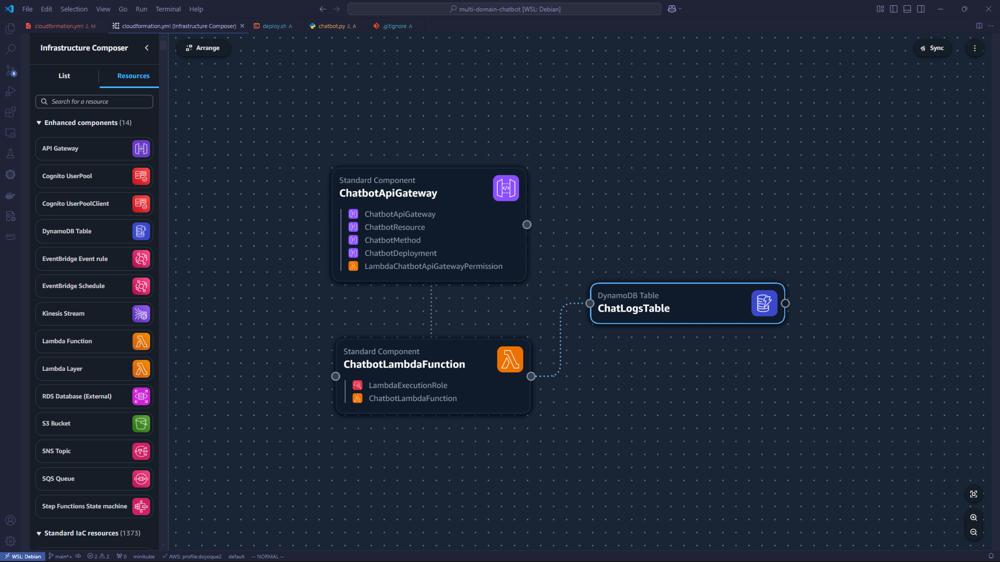

# Chatbot App

Simple chatbot that only answer jokes and current weather.

## Architecture Overview

AWS resources: API Gateway, Lambda, S3, DynamoDB


## Requirements

- aws cli configuration (access_key and secret_access_key)
- Python3.9 or higher
- https://openweathermap.org/api API key

## Deployment

With `deploy.sh` bash script it contain sequential process:
- create S3 bucket if not exists
- install the requirement packages of lambda app
- bundle up `lambda/` directory with zip
- uploading the `.zip` file to created S3 bucket
- execute cloudformation stacks resource
- fetch API Gateway invoke URL
- test the API with current weather query

```bash
# deploy cloudformation stacks
./deploy.sh

# destroy cloudformation stacks
aws cloudformation delete-stack --stack-name ChatbotLambdaStack
```

Successful deployment process:


## Example API

URL: https://cj17kisov7.execute-api.ap-southeast-1.amazonaws.com/prod/chatbot
When ask about random jokes:
```bash
# telling you a random jokes
curl --location 'https://cj17kisov7.execute-api.ap-southeast-1.amazonaws.com/prod/chatbot' \
--header 'Content-Type: application/json' \
--data '{
  "query": "Tell me a jokes"
}'
```

The answer:
```json
{
  "response": "What do you call a cow on a trampoline? A milk shake!"
}
```

When ask the current weather of a city
```bash
# Check current weather (make sure to put city,country)
curl --location 'https://cj17kisov7.execute-api.ap-southeast-1.amazonaws.com/prod/chatbot' \
--header 'Content-Type: application/json' \
--data '{
  "query": "What is the weather in London,uk"
}'
```

The answer:
```json
{
  "response": "Weather in London,uk: {'coord': {'lon': -0.1257, 'lat': 51.5085}, 'weather': [{'id': 804, 'main': 'Clouds', 'description': 'overcast clouds', 'icon': '04d'}], 'base': 'stations', 'main': {'temp': 282.33, 'feels_like': 280.09, 'temp_min': 281.21, 'temp_max': 283.22, 'pressure': 1013, 'humidity': 82, 'sea_level': 1013, 'grnd_level': 1008}, 'visibility': 10000, 'wind': {'speed': 4.12, 'deg': 260}, 'clouds': {'all': 100}, 'dt': 1740478203, 'sys': {'type': 2, 'id': 2091269, 'country': 'GB', 'sunrise': 1740466458, 'sunset': 1740504789}, 'timezone': 0, 'id': 2643743, 'name': 'London', 'cod': 200}"
}
```